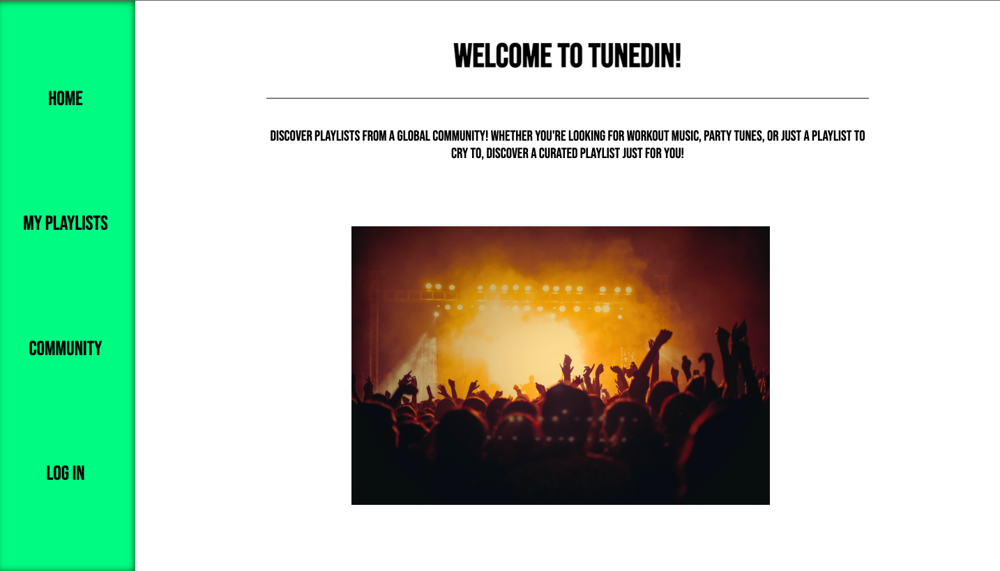
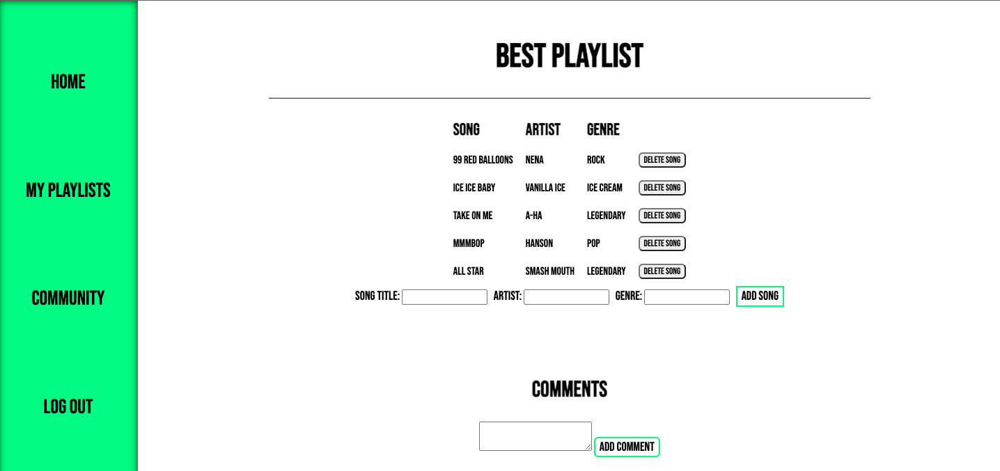
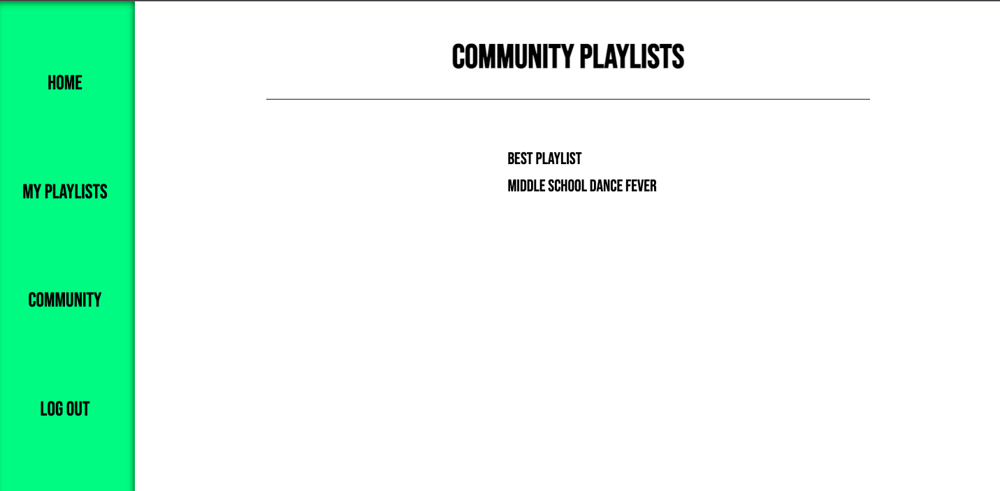

# TunedIn - A MongoDB CRUD App
## About the App
TunedIn is an app where people can create and share playlists with each other. By logging in via Google authorization, users can customize playlists, which will be available for others to view and take inspiration from. 
The interface was designed with simplicity in mind, so users can easily learn how to use the site through exploration.
The app is currently being hosted on Cyclic.
## Site Examples
### Home Page 

### Playlist View/Edit

### Community Playlist Page

## Technologies Used
* HTML5
* CSS
* Javascript
* Node.js
* MongoDB with Mongoose

## Getting Started
[Visit the app here!](https://gold-outstanding-octopus.cyclic.app)

[Project Planning Board](https://trello.com/b/1jD4atCX/project-two-mongodb)

## Next Steps
* Put in user checks outside of the Community Page to prevent users from editing each others' playlists
* Explore API options with music databases or services (like Spotify)
* Add event listeners and keyframes to make the site more dynamic
* General CSS enhancements to make the site cleaner and more responsive